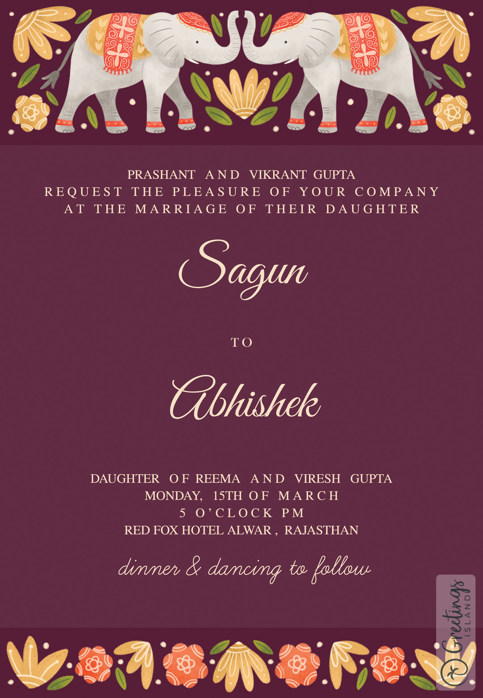

<p align="center"><a href="https://www.sagun-abhishek.online/WeddingInvite/"></a></p>
<h1 align="center"><a href="https://sagun-abhishek.netlify.app/assets/Sagun & Abhishek.pdf">Wedding Invitation</a> :ring: <br> <br> SAVE THE DATE: 15th Mar, 2021 <br> <a href="https://sagun-abhishek.online/">Website</a></h1>

## Wedding Invitation :ring:

<details>
  <summary><strong>View Invitation</strong></summary>
  <a href="https://sagun-abhishk.online/"></a>
</details>

With the divine grace of the almighty, inviting you and your family to Saharsh's wedding to be held on **15th March at [Red Fox Hotel](https://goo.gl/maps/AhkNVzkAwkLzGGeM6), Alwar, Rajasthan from 4:00 PM** onwards.

- [Download](https://sagun-abhishek.netlify.app/assets/Sagun & Abhishek.pdf) the Invitation card

- Find [venue](https://goo.gl/maps/AhkNVzkAwkLzGGeM6) on Google map

- Visit the [website](https://sagun-abhishk.online) for more details

```js
const newCouple = "Sagun & Abhishek";

// Feb 14, 2021
const weddingDate = new Date(2021, 03, 15);

// Wedding venue: https://goo.gl/maps/AhkNVzkAwkLzGGeM6
const weddingVenue = new Location("Red Fox Hotel Alwar, Rajasthan");

(function () {
  newCouple.willTieKnot(weddingDate);

  // your presence is requested
  new Wedding().acceptInvitation(window.open("https://sagun-abhishk.online/"));
})();
```

## Are you or your loved ones a _bride-to-be_ or _groom-to-be_?

> Feel free to use this template to build your wedding website!

### Do not forget to leave a star! :hugs:

<br><sup><i>With warm regards,<br>
**Prashant Gupta**<i></sup><br>
